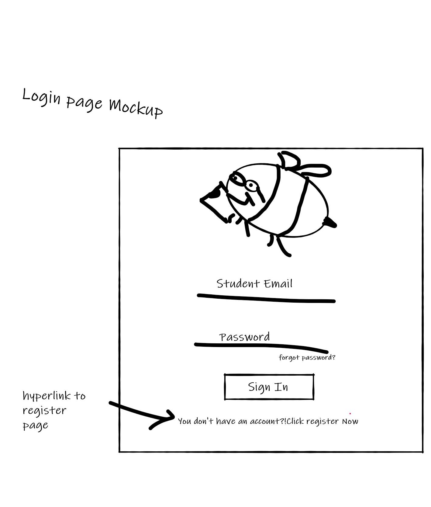
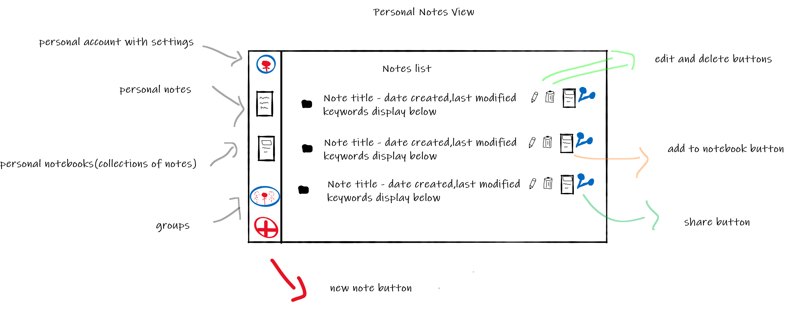
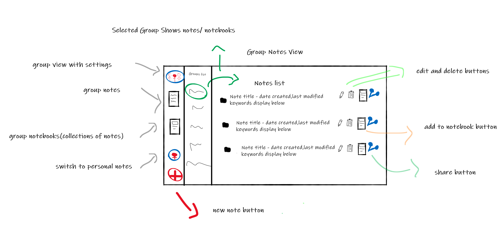
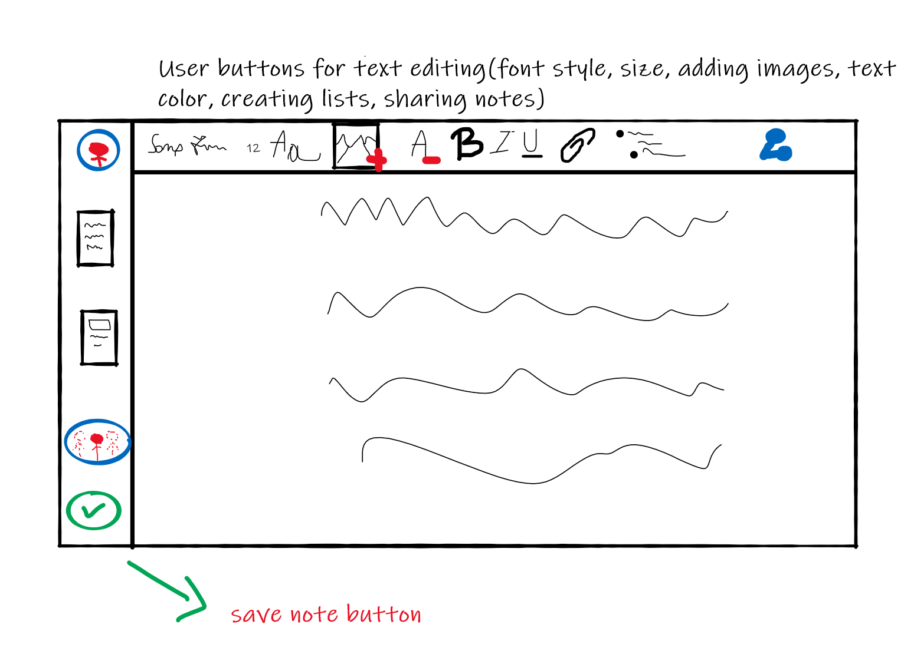

# NoteBee
## Project - Student Notes
## Introduction
- What is the main necessity this product meets?  
NoteBee gives students a way to create and share notes with each other, either individually or in study groups. The main problem it solves is one of organization and information sharing, aiming to make it as easy and streamlined as possible.
- To whom is this product addressed?  
Our app is destined only for students, as it is a niche application, designed in order to help students organize their notes more efficiently.
- What other similar existing products are there on the market?  
StuDocu: an app where you can share and download study-related resources to help you save time and study efficiently.  
You can find it [here](https://www.studocu.com/).  
Evernote: a powerful tool that can help executives, entrepreneurs and creative people capture and arrange their ideas. "All you have to do is use it." - Forbes  
You can find it [here](https://evernote.com/).  
## Interface
- Login Page  

- Personal Notes View  

- Group Notes View  

- Note Editor View  

## Components
1. Login/Registration form
2. Note form
3. Personal Notes view
4. Group Notes view
5. Note Editor view
6. Edit/Delete note button
7. Share note button
8. Save note button
9. Add to notebook button
10. Add new note button
## API Calls
- GET /notes
- POST /notes
- GET /groups
- GET /groups/:id
- POST /groups
- GET /notes/:id
- PUT /notes/:id
- DELETE /notes/:id
## User Actions
- Login/Register
- View Courses/Groups/Notes
- Add note
- Edit Note (Font, Font size, add image, color, attach file, etc…)
- Share note
- Delete note

